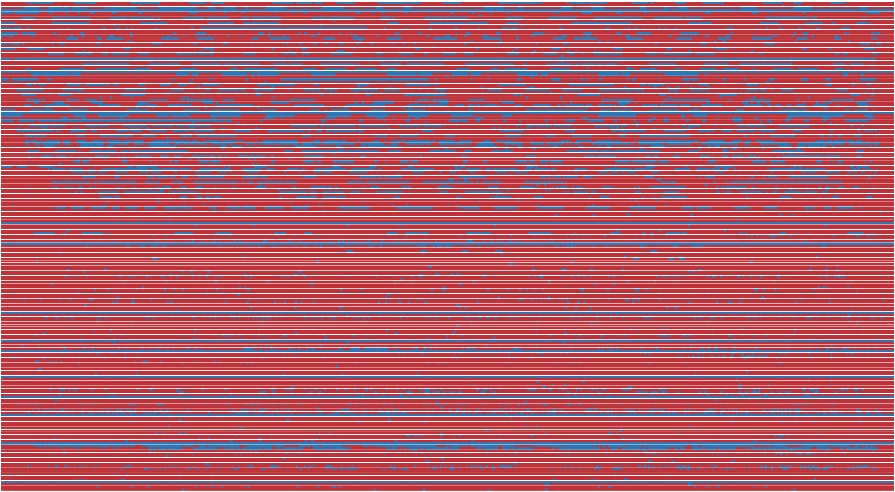

# EPFL Extension School Capstone Project for COS Applied Data Science: Machine Learning

### Assessing the share of male and female voices in (Swiss-) German audio media with machine learning

### 1) The problem

#### Mass media is dominated by male protagonists and voices

In many articles, broadcasts, programmes, shows and podcasts audiences will see and hear (and read from and about) way more men than women. 

[According to the Global Media Monitoring Project 2016, as much as 82% of all media reports are about men](https://www.ringier.com/en/equalvoice-initiative-increase-womens-visibility-media-coverage). In Switzerland this figure is as high as 75%. A [very thorough analysis from INA](https://www.viewjournal.eu/article/10.18146/2213-0969.2018.jethc156/) of about 700k hours of French audiovisual documents in 2018 shows that ***«men speak twice as much as women on TV and on radio.»*** 

#### Media equality projects

To overcome this inequality media companies have started initiatives to improve the gender balance in their offerings. The most prominent example is BBC's [«50:50 – The equality project»](https://www.bbc.co.uk/5050/). 

To achieve fairer gender ratios media companies have to actively track gender (im)balance and level out the contribution and presence of men and women. For that the companies have to count the share of female and male contributions in its various forms. Teams can then use this data to inform editorial and production decisions and by that improve gender equality. [The tracking is mostly done manually which is likely quite time consuming. Semiautomatic and automatic methods are employed as well](https://www.reflectreality.internews.org/chapter-4/tracking).

#### Helping approach: Automate tracking as much as possible

I´d like to **make the tracking of gender in media easier by using audio analysis and machine learning**. I aim to **build a classifier that identifies the biological sex of a German/Swissgerman speaker in a given audio file.** 

#### Motivation to analyze podcasts
Podcasts are a hugely popular media category that has seen enormous growth during recent years. The domain isn't well researched in terms of gender representation especially not for the German speaking markets.

### 2) Approach

- I use Mozillas open source voice data set **[CommonVoice](https://commonvoice.mozilla.org/en)** that has been created with the help of thousands of volunteers. 
- I extract the **fundamental frequency FO and mel-frequency cepstral coefficients (MFCCs) as features.** 
- I **train various machine learning models (linear, non-linear, DNNs, ensembles)** and predict in the target domain of podcast media.
- I built a pipeline that cuts whole episodes of podcasts into 2 second segments and classifies the gender of the speaker. 

### 3) Results
- **The approach is viable.** 
- The **trained models achieve an accuracy of ~0.93 on a representative podcast test data set** with mostly hard to predict samples.
- **Analysis can be done fast and efficiently:** 1 hour of podcast takes 1 – 1.5 minutes of processing.
- Results are validated by examining predictions on more than 50 episodes of podcasts.

An exemplary analysis of all 191 episodes (78hrs) of a prototypical podcast yields the plot below. 
- Gender share is calculated for each episode.
- Each row represents one episode, starting with the row for the first episode at the bottom. 
- Color red indicates a predicted male voice, blue indicates a female voice.
- **The total share of male voice in this case was 88%.**

### 4) Outlook

Accuracy and robustness of the prediction can be improved by
- adding more samples from actual podcasts which in general have higher production quality and more professionally trained voices
- adding voice activity detection (VAD) which allows to remove samples where no voice is present
- adding more audio features that will help classify hard to predict samples, e.g. women with particularly deep voices or men with high pitched vocal expression

---
### Acknowledgements

I am very grateful to EPFL teachers [Michael Notter](https://www.linkedin.com/in/michael-notter-5542b464/) and [Panagiota Xydi](https://www.linkedin.com/in/panagiotaxydi/) for their enormous support, outstanding proficiency (and super good humor) during the course and this project. 😊🙏

Thanks too to [EPFL Extension School](https://www.extensionschool.ch/) and all the other excellent teachers for all their efforts and for putting together such a valuable course. 👍 

